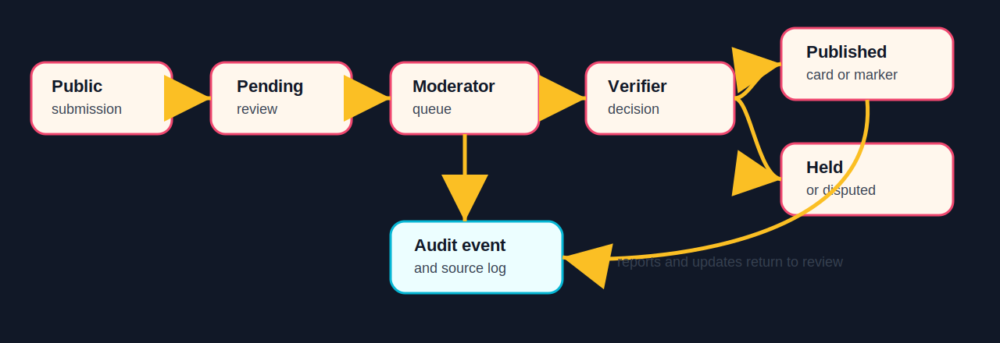
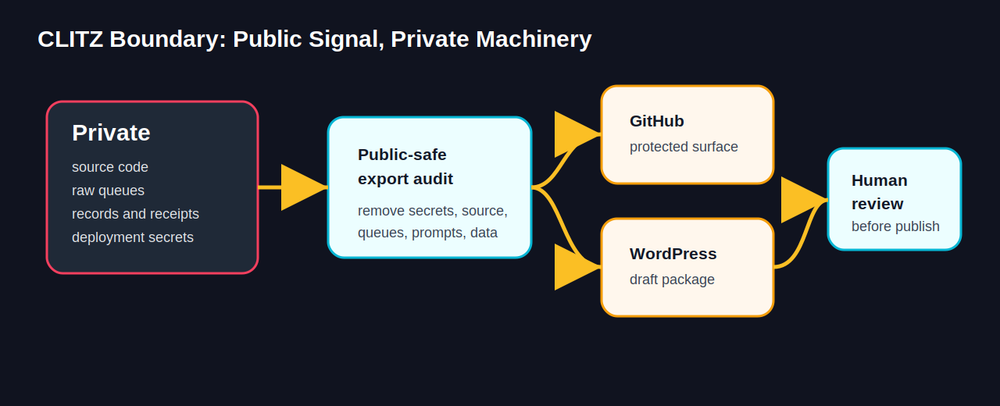

# CLITZ.xyz

A galaxy of female.

CLITZ.xyz is a women-centered safety, health, privacy, mutual aid, memory, review, prayer, debate, and creator-scaffold platform for women who need care, women who need witness, women who need privacy, and women who refuse to disappear.

> This repository is a protected public project surface. It is not the full source code, operational system, private workflow, or data room.

## What Is This?

CLITZ.xyz is being built as a global women-centered platform for maps, directories, reviews, mutual aid, legal/safety placeholders, and moderated community scaffolding. The first implementation wave is a proprietary WordPress MVP called CLITZ Galaxy Core.

The private implementation includes local WordPress plugin work, operational scripts, moderation flows, deployment gates, and CLITZ workspace receipts. This public repository presents the public story, workflow, status, visuals, ownership posture, and WordPress page draft without releasing private source or sensitive operations.

## Why It Matters

Women-centered safety systems often fail women at the exact moment they need care, witness, verification, privacy, and practical help. CLITZ is designed around a different posture:

- privacy before virality
- moderation before scale
- source quality before claims
- survivor location safety before map completeness
- women-centered identity context without forced disclosure
- public heat, private control
- receipts before claims

## Who It Is For

CLITZ is for cis women, trans women, intersex women, gender-expansive women, women of color, LGBTQIA+ women, mothers, disabled women, religious women, politically diverse women, survivors, creators, and women seeking privacy, care, support, recognition, protection, or creative freedom.

## How It Works

1. A public visitor submits a listing, review, update request, abuse report, prayer room, debate topic, mutual aid request, or fundraiser.
2. CLITZ holds the content in pending or report review.
3. Moderators and verifiers review source quality, location safety, identity consent, defamation risk, and fraud concerns.
4. Approved records become public cards, directories, and safe map markers.
5. Disputed, outdated, removed, or private records stay held.
6. Audit events and source logs preserve the receipt trail.

## Current MVP

The first-wave WordPress MVP includes:

- missing women/girls records
- testosterone provider directory
- DV service directory
- assault resource directory
- female-review directory
- mutual aid and fundraiser listings
- prayer rooms and debate topics
- privacy-safe location modes
- verification badges
- moderated front-end submissions
- abuse/update reports
- admin moderation dashboard
- CSV import/export dry-run workflow
- legal placeholder pages for attorney review
- Phase 5 private creator hosting scaffold only

## What Is Public

- Public project description and mission
- Workflow diagrams and platform boundary
- CLITZ Galaxy MVP status
- WordPress page draft
- Image/brand asset audit
- Roadmap, FAQ, privacy review, launch checklist, and receipts
- Ownership, security, trademark, and commercial-use policy

## What Remains Private

- WordPress plugin source code
- Desktop app source code and runtime state
- Prompts, private workflows, raw queues, and operational receipts
- Credentials, tokens, server details, deployment secrets, and private config
- Admin screenshots, moderation queues, raw reports, and vault data
- Adult/private creator operations and unpublished content
- Customer, family, medical, legal, benefits, and private personal data

## WordPress Interface

The private CLITZ Galaxy Core plugin exposes these public WordPress shortcodes:

| Shortcode | Public purpose |
| --- | --- |
| `[clitz_galaxy_home]` | Galaxy landing sections |
| `[clitz_map type="..."]` | Leaflet/OpenStreetMap maps |
| `[clitz_directory type="..."]` | Directory cards |
| `[clitz_submit_listing type="..."]` | Pending public submissions |
| `[clitz_reviews target="..."]` | Moderated reviews |
| `[clitz_mutual_aid]` | Aid and fundraiser listings |
| `[clitz_moderation_dashboard]` | Trusted moderator dashboard |

## Visual Gallery

| Asset | Purpose |
| --- | --- |
|  | Public social preview |
|  | Project icon |
|  | Directory/gallery visual |

## Learn More

- [Project Brief](docs/PROJECT_BRIEF.md)
- [CLITZ Galaxy MVP](docs/CLITZ_GALAXY_MVP.md)
- [Status](docs/STATUS.md)
- [Roadmap](docs/ROADMAP.md)
- [Public / Private Boundary](docs/PUBLIC_PRIVATE_BOUNDARY.md)
- [Workflow Diagrams](docs/WORKFLOW_DIAGRAMS.md)
- [Privacy Review](docs/PRIVACY_REVIEW.md)
- [Canva Launch Receipt](docs/CANVA_LAUNCH_RECEIPT.md)
- [WordPress Page Draft](wordpress/page.md)

Public web destination draft: [FaithCheltenham.com/projects/clitz](https://faithcheltenham.com/projects/clitz/)

## Ownership

CLITZ.xyz is owned by Faith Cheltenham / XXYYZZ Society LLC. All rights reserved. No source release is granted by this repository. No redistribution, AI training, commercial use, sublicensing, or implied permission is granted.
