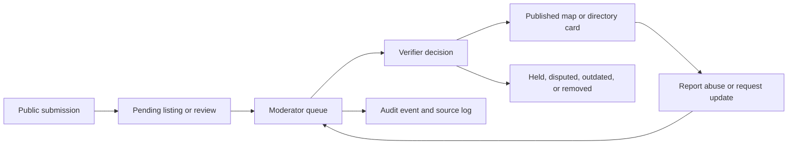
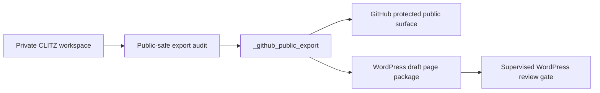
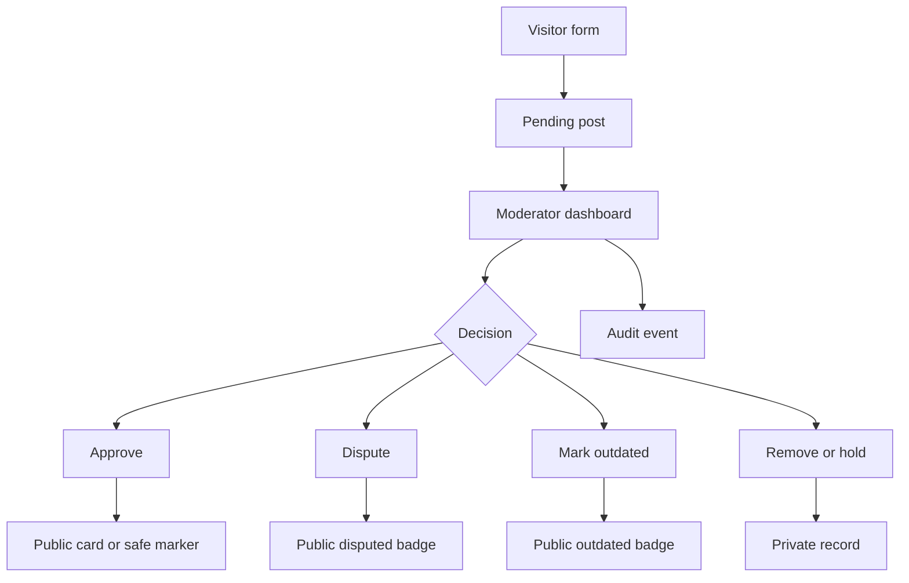
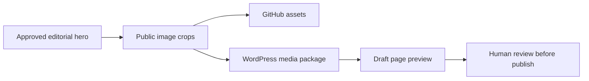

# Workflow Diagrams

## Platform Flow

```mermaid
flowchart LR
  A["Public submission"] --> B["Pending listing or review"]
  B --> C["Moderator queue"]
  C --> D["Verifier decision"]
  D --> E["Published map or directory card"]
  D --> F["Held, disputed, outdated, or removed"]
  C --> G["Audit event and source log"]
  E --> H["Report abuse or request update"]
  H --> C
```

## Public / Private Boundary

```mermaid
flowchart LR
  A["Private CLITZ workspace"] --> B["Public-safe export audit"]
  B --> C["_github_public_export"]
  C --> D["GitHub protected public surface"]
  C --> E["WordPress draft page package"]
  E --> F["Supervised WordPress review gate"]
```

## WordPress Moderation

```mermaid
flowchart TD
  A["Visitor form"] --> B["Pending post"]
  B --> C["Moderator dashboard"]
  C --> D{"Decision"}
  D --> E["Approve"]
  D --> F["Dispute"]
  D --> G["Mark outdated"]
  D --> H["Remove or hold"]
  E --> I["Public card or safe marker"]
  F --> J["Public disputed badge"]
  G --> K["Public outdated badge"]
  H --> L["Private record"]
  C --> M["Audit event"]
```

## Image Deployment

```mermaid
flowchart LR
  A["Approved editorial hero"] --> B["Public image crops"]
  B --> C["GitHub assets"]
  B --> D["WordPress media package"]
  D --> E["Draft page preview"]
  E --> F["Human review before publish"]
```

